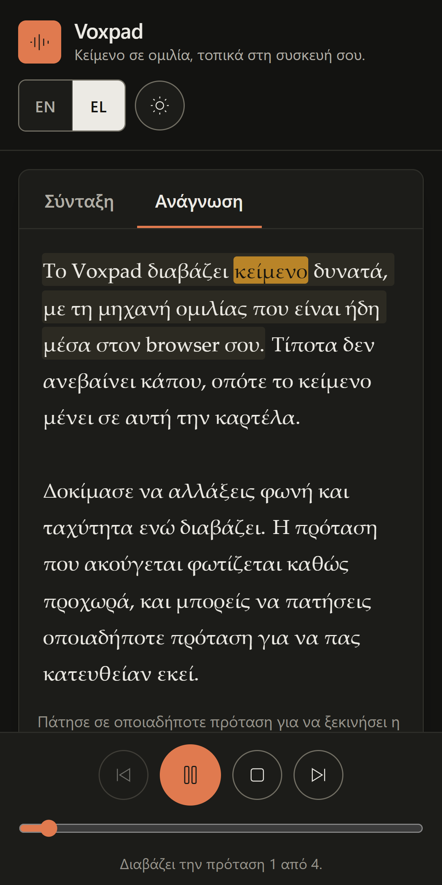

# Voxpad

A text to speech reader that runs entirely in the browser. Paste text or drop a file, pick a
voice, and listen while the sentence being spoken is highlighted. No build step, no dependencies,
no backend.

Built with plain HTML, CSS and JavaScript (ES modules) on top of the Web Speech API. A React
Native companion, [Voxpad Mobile](https://github.com/DimNt3000/voxpad-mobile), ports the same
architecture to Android and iOS.

**Live demo:** https://dimnt3000.github.io/voxpad/


<p align="center">
  
</p>

<p align="center"><em>The same build in dark theme with the interface switched to Greek.</em></p>

## What it does

- Reads any pasted text aloud with the voices installed on the device.
- Highlights the sentence being spoken, and the individual word where the engine reports one.
- Click any sentence to start reading from there, or drag the position slider to seek.
- Play, pause, resume, stop, and skip by sentence, from buttons or the keyboard.
- Speed, pitch and volume, applied live and remembered between visits.
- Voices grouped by language, with a language filter and a label saying whether the voice runs on
  the device or on the browser vendor's servers.
- Suggests a matching voice when the text is written in a non Latin script.
- Imports `.txt` and `.md` files by button or by dropping them anywhere on the page.
- Two interface languages, English and Greek, switchable at runtime.
- Light and dark themes, following the system setting until you choose one.
- Installable and fully usable offline through a service worker.
- Keyboard shortcuts: <kbd>Space</kbd>, <kbd>Esc</kbd>, <kbd>&larr;</kbd> <kbd>&rarr;</kbd>,
  <kbd>Ctrl</kbd>+<kbd>Enter</kbd>, <kbd>?</kbd>.

## Run it locally

The app uses ES modules, which browsers refuse to load from `file://`, so it needs to be served
over http. Any static server works:

```bash
python -m http.server 8000
```

Then open `http://localhost:8000`. Opening `index.html` directly shows a notice explaining this.

With Node installed instead:

```bash
npx --yes serve .
```

## Deploy

Every file is static, so any static host works. `.github/workflows/deploy.yml` publishes the
repository root to GitHub Pages on every push to `main`. Enable it once under
**Settings, Pages, Source: GitHub Actions**.

## How it works

### Chunking instead of one long utterance

Handing a whole document to `speechSynthesis.speak()` fails in practice: Chromium truncates long
utterances, and there is no way to know where the engine currently is. `js/text-segmenter.js`
splits the text into sentences with `Intl.Segmenter` (falling back to a hand written scanner),
then breaks anything still over 180 characters on word boundaries. Each chunk keeps its offsets in
the original string, which is what makes the reader view able to rebuild the text with its
whitespace intact.

Sentence sized chunks also give the app a cursor. Highlighting, seeking and "next sentence" all
work from the chunk index, so they keep working on engines that never fire word boundary events.

### Working around the platform

`js/tts-engine.js` exists because the Web Speech API behaves differently in every browser:

| Problem | Handling |
| --- | --- |
| Chromium stops speaking after about 15 seconds | A watchdog calls `pause()` then `resume()` every 9 seconds while speaking, on Chromium only |
| Android treats `pause()` as `cancel()` | `resume()` checks whether anything is still speaking and restarts the current sentence if not |
| `cancel()` fires `onend`, which looks like normal completion | Every utterance carries a generation token, stale callbacks are ignored |
| `getVoices()` is empty on first call, and `voiceschanged` never fires in some Safari builds | `js/voices.js` resolves on whichever of the event or a poll arrives first, with a timeout |
| Utterance settings cannot change once created | Changing voice, speed or pitch mid playback restarts the current sentence with the new settings |
| Safari reports word boundaries without a length | The word is measured from the chunk text instead |

### Highlighting without rebuilding the document

`js/reader-view.js` renders each sentence once as a `<span>`. When a word boundary arrives, only
the active sentence is rewritten into three parts (before, word, after), so the cost per highlight
does not grow with the length of the document.

## Project layout

```
index.html               markup and the inline theme bootstrap
privacy.html             what is stored and the one case where text leaves the device
css/styles.css           design tokens, light and dark themes, mobile first layout
js/main.js               controller, wires the DOM to everything else
js/tts-engine.js         speechSynthesis wrapper, events, browser workarounds
js/text-segmenter.js     sentence splitting, counts, script detection
js/reader-view.js        sentence rendering and highlight
js/voices.js             voice loading, grouping and sorting
js/storage.js            preferences and draft text in localStorage
js/i18n.js               English and Greek strings
sw.js                    offline cache
manifest.webmanifest     installable app metadata
```

## Browser support

Works in current Chrome, Edge, Safari and Firefox on desktop, and in Chrome and Safari on mobile.
Where speech synthesis is missing the interface still loads, playback is disabled, and the reason
is shown in the status line.

The number and quality of voices comes from the operating system, not from this app, so the voice
list looks different on Windows, macOS, Android and Linux. Linux often ships none at all until a
speech package such as `speech-dispatcher` is installed.

## Accessibility

Semantic landmarks and headings, labelled controls, visible focus rings, tap targets of at least
44 by 44 pixels, text contrast of at least 4.5:1 and control borders of at least 3:1 in both
themes, a live region announcing the reading position, full keyboard operation, and
`prefers-reduced-motion` respected for the auto scroll.

## Privacy

No account, no backend, no analytics, no cookies. Preferences and the draft text are kept in
`localStorage` on the device. The one exception is that some browser voices are rendered on the
vendor's servers, in which case the browser sends the sentence there; those voices are labelled in
the interface. See [privacy.html](privacy.html).

## Known limitations

- Audio cannot be exported to a file. The Web Speech API plays through the system audio path and
  gives pages no access to the generated samples.
- Word level highlighting depends on the engine emitting boundary events. Some voices, mainly the
  network rendered ones, emit none, and the app falls back to sentence level highlighting.
- iOS requires playback to start from a user gesture, so the first press must be a real tap.
- The install prompt uses SVG icons. Add PNG icons at 192 and 512 pixels for the widest install
  support.

## License

MIT, see [LICENSE](LICENSE). Built by Dimitrios-Georgios Ntoulias.
